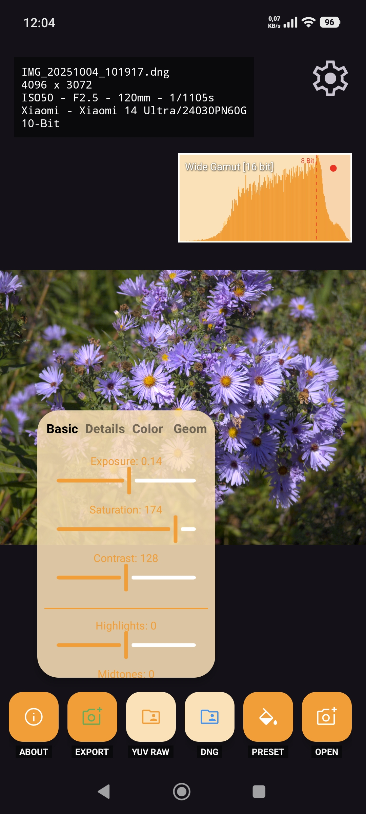
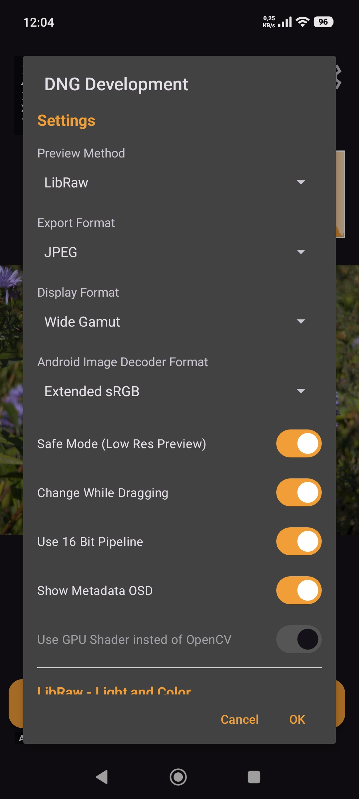
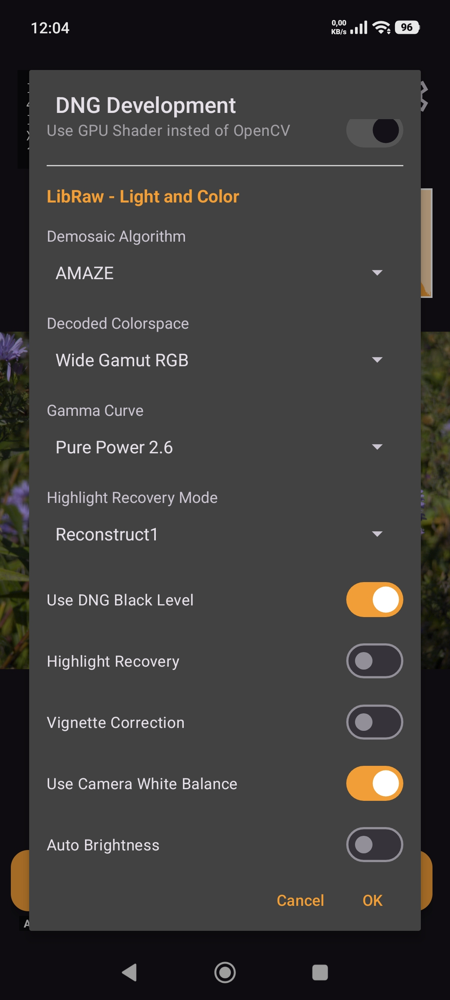
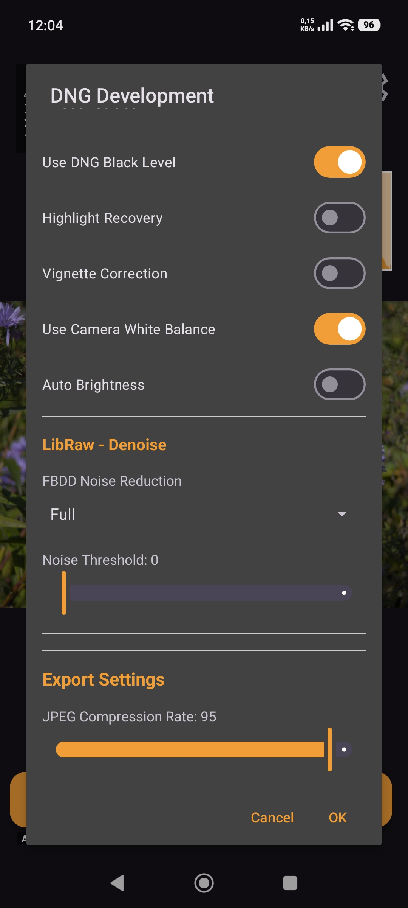
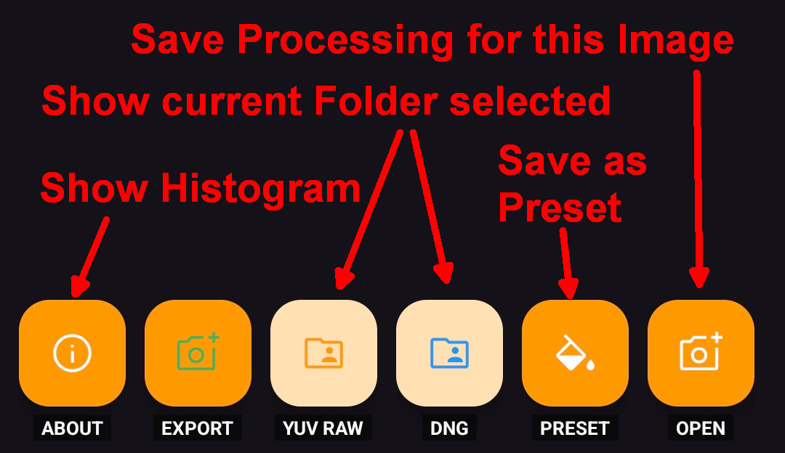

# Purpose
DngMaster ist an Android app to edit DNGs (Adobes Digital Negative aka RAW from mobile devices)

**Requires Android API Version 33 (Android 13 -Tiramisu) or higher**

## Features
* Open and edit DNG files
* Open and edit WebP files
* Open and edit HEIC/HEIF files
* Open and edit YUV pseudo RAW created with PhotonVidCam
* Shader based processing
* 10 bit histogram
* Export results to: JPEG, WebP, PNG, 10 bit HEIC
* Create and use presets
* Save processing of an image
* Settings & processing persited in metadata

## Dependencies
* [LibRaw](https://www.libraw.org/download)
* OpenCV (only with special build as this raises APK size by far)

## Screenshots
<table>
  <tr>
    <td></td>
    <td></td>
  </tr>
  <tr>
    <td></td>
    <td></td>
  </tr>
</table>

## Longpress Actions
* Open Button: saves current post processing (not the app settngs like the ones of LibRaw)
* Preset Button: saves the current post processing settings as named preset
* DNG & YUV RAW Button: shows the currently set pathes
* About Button: show/hide histogram
* Settings Button: reset app settings (every parameter behind the settings menu)
* On image: resets the postprocessing (shader/OpenCV) settings

  

## Gestures
* Two Fingers: tapping with two finges in the image unprocessed version is shown (processed after fingers released again)
* Swipe Left: next image (if this forder was given permission/access)
* Swipe Right: previous image (if this forder was given permission/access)
